# EstilosCall-Return

EJERCICIO 1
---

URL: https://teams.microsoft.com/v2/

URL: https://myaccount.microsoft.com/?ref=MeControl

EJERCICIO 2
---
URL: https://www.instagram.com/

url: https://developer.mozilla.org/es/docs/Web/HTTP

EJERCICIO 3
---

Primero ejecuetamos el servidor, este se queda esperando y luego corremos el cliente, aqui nos pide el numero
y el servidor nos devuelve el cuadrado del número.

Número: 2

**Cliente** 

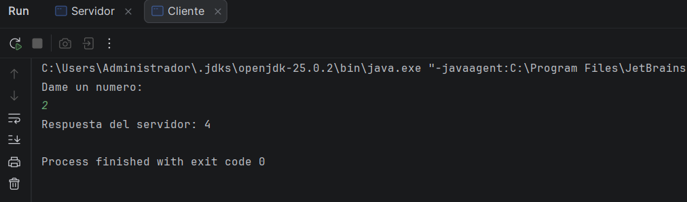

**Servidor**

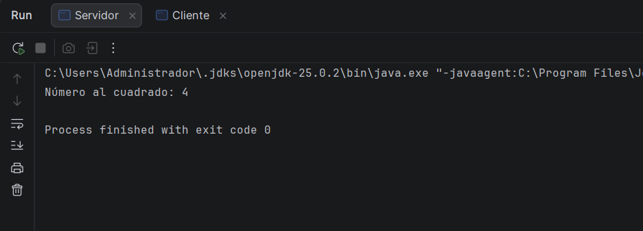

Número: 485

**Cliente**

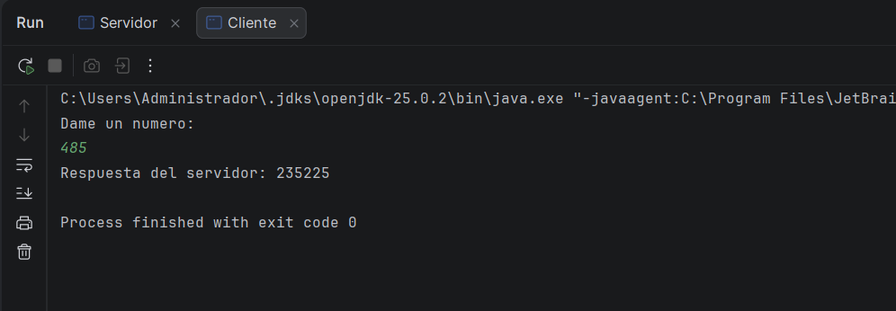

**Servidor**

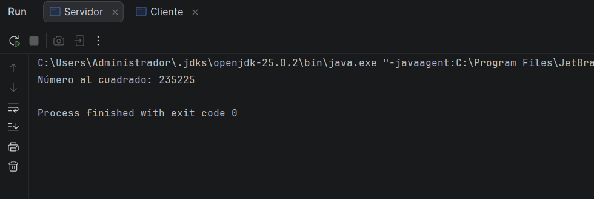

---
## EJERCICIO 4

---
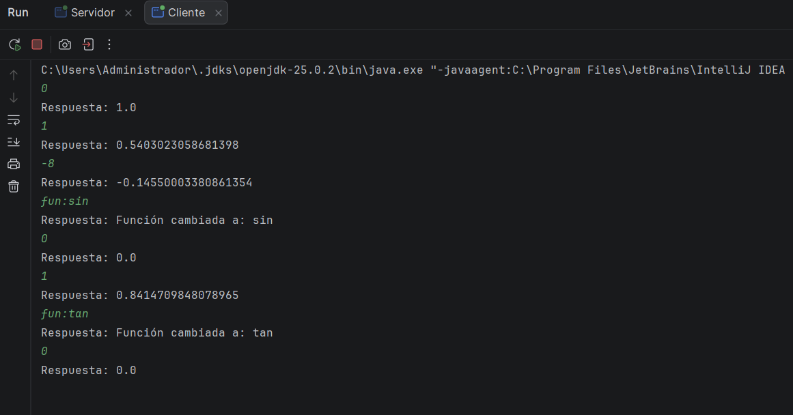

## EJERCICIO 5

---

http://localhost:6565/servidorWeb.png

EXPLORADOR WEB

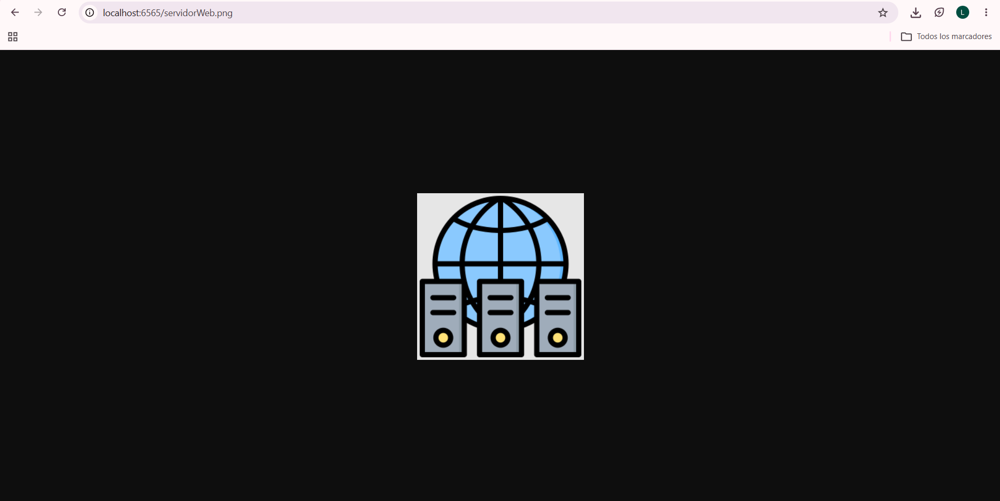

TERMINAL

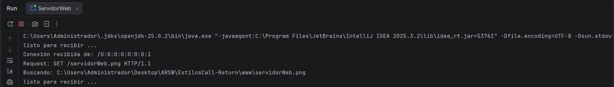

http://localhost:6565/index.html

EXPLORADOR WEB

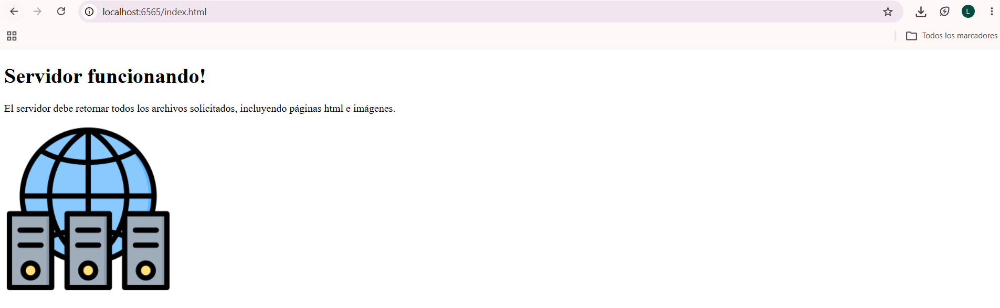

TERMINAL 
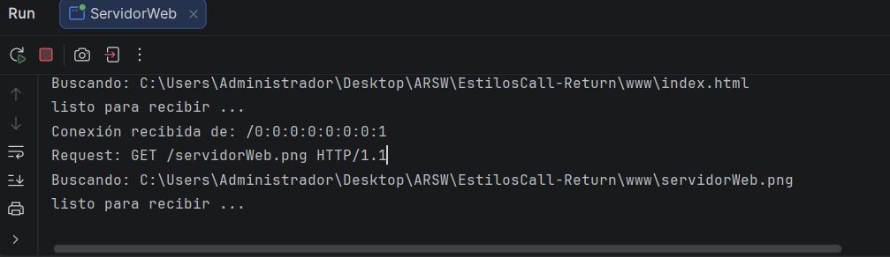

## EJERCICIO 6

---

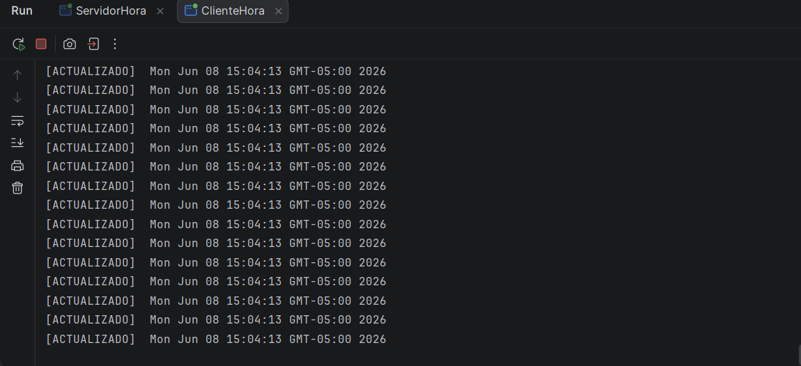

Cuando apago el servidor 

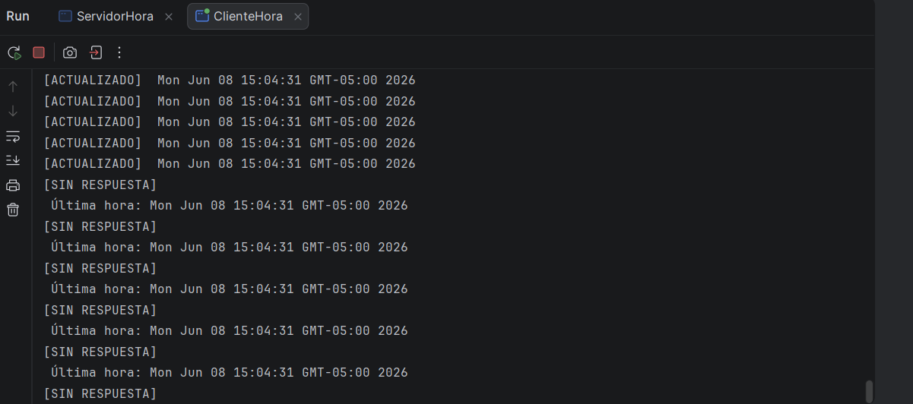

## EJERCICIO 7

---

Instancia persona 1

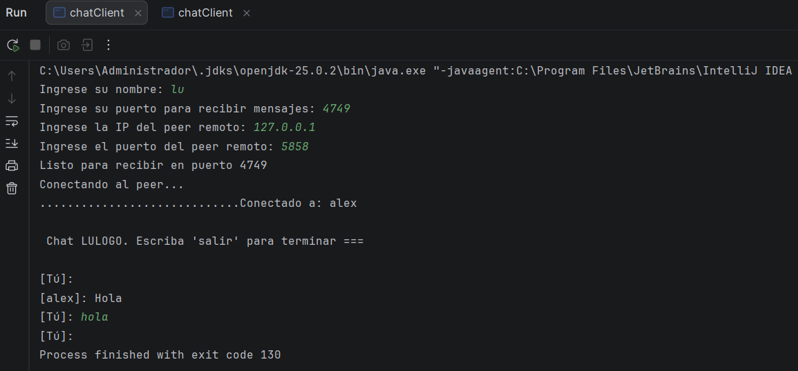

instancia persona 2

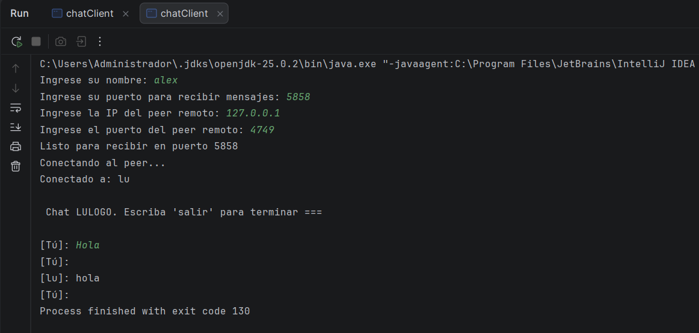

